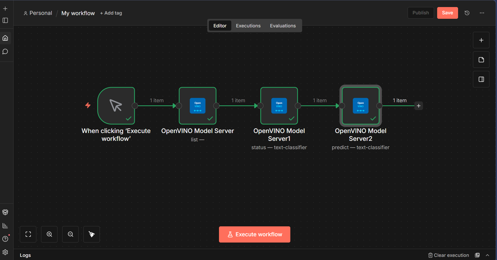

# n8n + OpenVINO Model Server Integration

**GSoC 2026 Proof of Concept** — Custom n8n community node that connects to Intel's OpenVINO Model Server for AI inference.

## Architecture

```
n8n (custom node)
  |  sends plain text
  v
Gateway (Python, port 8000)
  |  tokenizes text into tensors
  v
OpenVINO Model Server (port 9001)
  |  runs DistilBERT inference
  v
Results flow back: OVMS → Gateway → n8n
  (logits)    (human-readable)   (displayed in UI)
```

- **n8n** — no-code workflow UI where users configure and run AI tasks
- **Gateway** — preprocessor that converts plain text to tokenized tensors and interprets results
- **OVMS** — Intel's official model serving container (`openvino/model_server:latest`) that runs the actual inference
- **DistilBERT** — pre-trained sentiment classifier converted to OpenVINO IR format

## Working Demo



## Features

- **3 operations** in the custom n8n node:
  - **List Models** — view all models deployed on OVMS
  - **Get Model Status** — check if a model is loaded and ready
  - **Predict** — send text, get sentiment analysis (POSITIVE/NEGATIVE with confidence score)
- **Device selection** — CPU, GPU, NPU, or AUTO (via OpenVINO's AUTO plugin)
- **Two API protocols** — KServe v2 and TensorFlow Serving v1
- **Docker Compose** — single command to start the entire stack

## Project Structure

```
n8n-openvino/
├── nodes/OpenVinoModelServer/
│   ├── OpenVinoModelServer.node.ts   # Custom n8n node (TypeScript)
│   └── openvino.svg                  # Node icon
├── credentials/
│   └── OpenVinoModelServerApi.credentials.ts
├── gateway/
│   ├── server.py                     # Tokenization gateway (Python)
│   └── Dockerfile
├── deployment/
│   ├── docker-compose.yml            # 4 services: OVMS, Gateway, n8n, PostgreSQL
│   ├── config.json                   # OVMS model configuration
│   ├── models/                       # Model files (not in git)
│   │   ├── text-classifier/1/        # DistilBERT OpenVINO IR (model.xml + model.bin)
│   │   └── tokenizer-backup/         # HuggingFace tokenizer files
│   └── sql/init.sql                  # PostgreSQL schema
├── package.json
└── tsconfig.json
```

## Quick Start

### Prerequisites

- Docker Desktop
- Node.js 18+
- ~2GB disk space for model files

### 1. Clone and install

```bash
git clone https://github.com/Nandkishore-04/n8n-openvino.git
cd n8n-openvino
npm install
npm run build
```

### 2. Prepare the model

Download DistilBERT and convert to OpenVINO IR format:

```bash
pip install openvino transformers torch
python -c "
from transformers import AutoModelForSequenceClassification
from openvino import convert_model, save_model

model = AutoModelForSequenceClassification.from_pretrained('distilbert-base-uncased-finetuned-sst-2-english')
ov_model = convert_model(model, example_input={'input_ids': __import__('torch').zeros(1, 512, dtype=__import__('torch').long), 'attention_mask': __import__('torch').zeros(1, 512, dtype=__import__('torch').long)})
save_model(ov_model, 'deployment/models/text-classifier/1/model.xml')
"
```

Save the tokenizer:

```bash
python -c "
from transformers import AutoTokenizer
tokenizer = AutoTokenizer.from_pretrained('distilbert-base-uncased-finetuned-sst-2-english')
tokenizer.save_pretrained('deployment/models/tokenizer-backup')
"
```

### 3. Start everything

```bash
cd deployment
docker compose up -d
```

### 4. Use it

1. Open **http://localhost:5678** (n8n)
2. Create a new workflow
3. Add the **OpenVINO Model Server** node
4. Set credential URL to `http://gateway:8000`
5. Select **Predict** operation, model name `text-classifier`
6. Send `{"text": "I love this product"}` — get back POSITIVE with confidence score

## Tech Stack

| Component | Technology |
|-----------|-----------|
| n8n Node | TypeScript, n8n-workflow SDK |
| Gateway | Python 3.12, HuggingFace Transformers |
| Model Server | OpenVINO Model Server (official Intel container) |
| Model | DistilBERT (OpenVINO IR format) |
| Database | PostgreSQL 15 |
| Orchestration | Docker Compose |

## How OVMS Is Used

This project uses the **official OVMS container** (`openvino/model_server:latest`) — no custom inference code. OVMS handles:

- Model loading and memory management
- REST API for inference requests
- Hardware acceleration (CPU/GPU/NPU)
- Model versioning and health checks

The Gateway exists because OVMS expects raw tokenized tensors, but n8n users want to send plain text. The Gateway bridges this gap.

## GSoC 2026 — Future Scope

This demo covers the core architecture. The full GSoC project would extend it with:

- Support for multiple model types (object detection, NER, translation)
- Dynamic model loading through n8n UI
- GPU/NPU device switching at runtime
- Batch inference for processing multiple documents
- Performance benchmarking across devices

---

*Built as a proof of concept for [GSoC 2026 Project #13: n8n Integration with OpenVINO](https://github.com/openvinotoolkit/openvino/wiki/GSoC-2026-Project-Ideas)*
