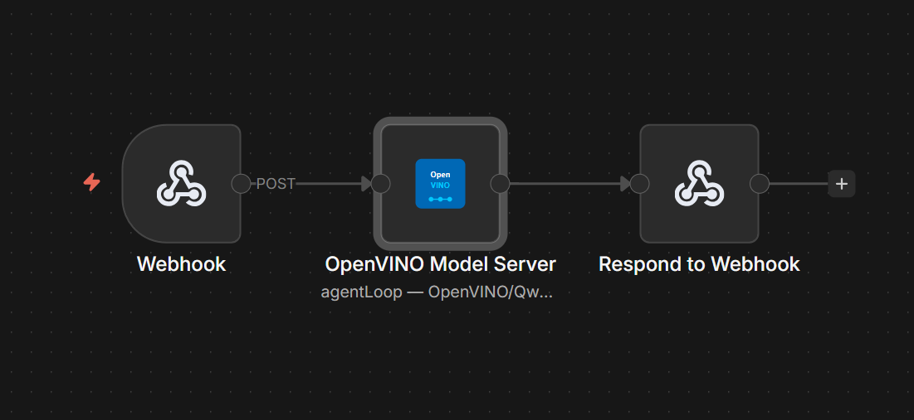
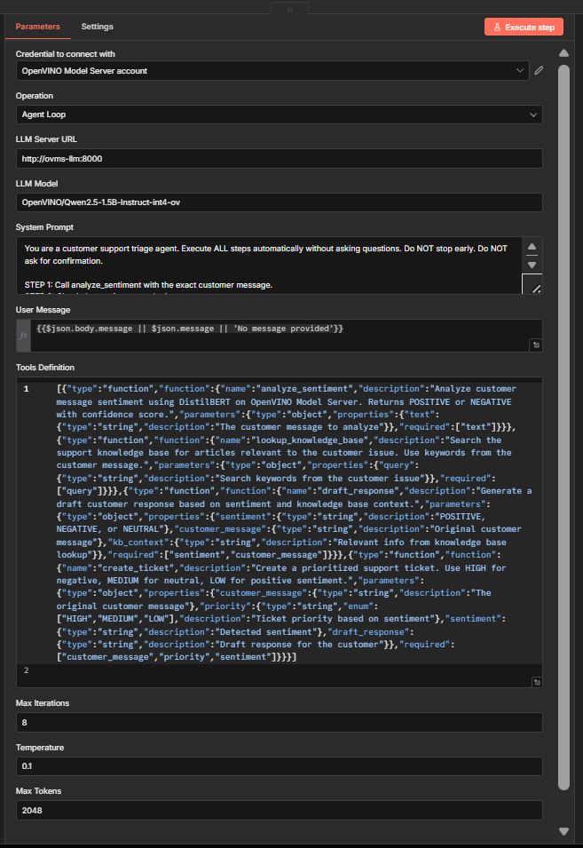
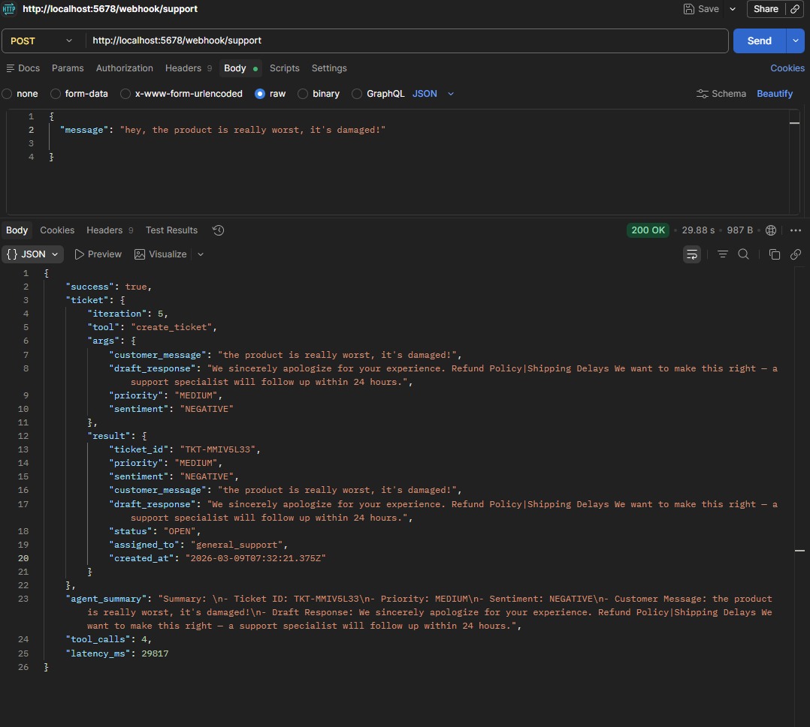
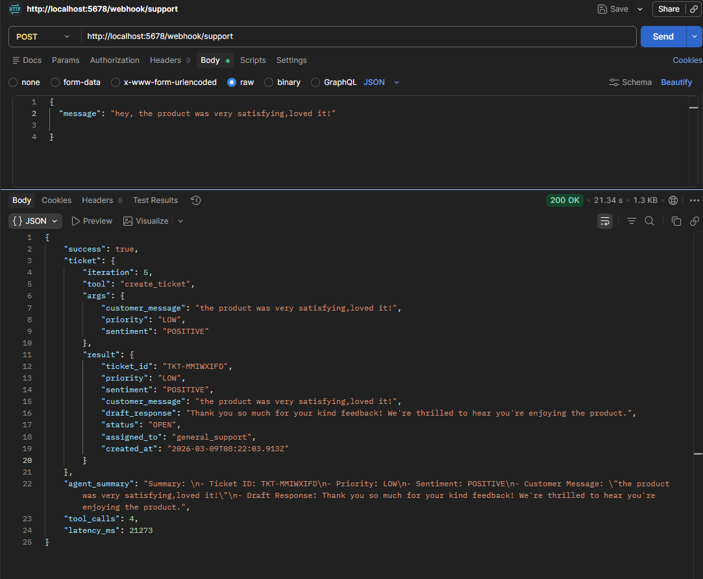
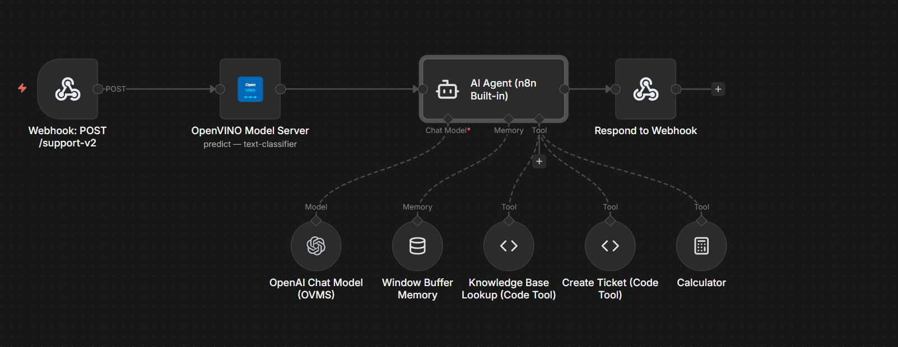
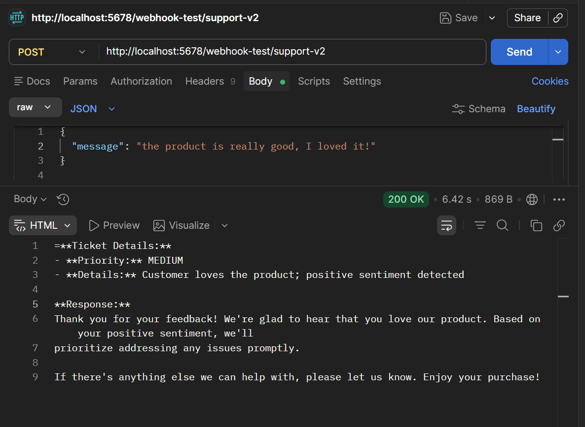
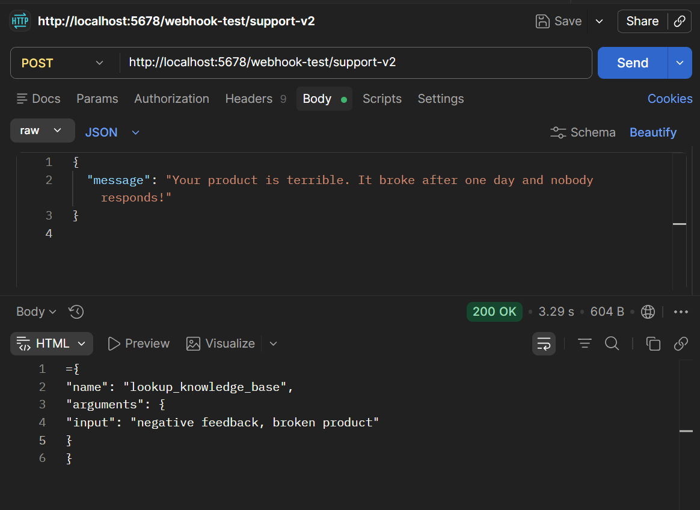

# n8n + OpenVINO Model Server Integration

**GSoC 2026 Proof of Concept** — Custom n8n community node that connects to Intel's OpenVINO Model Server for AI inference.

## Architecture

### Classic Inference (Sentiment Analysis)
```
n8n → Gateway (tokenizes text) → OVMS (DistilBERT) → Results back to n8n
```

### Agentic Workflow (Customer Support Triage)
```
[Webhook: POST /support]
        |
        v
[OVMS Agent Loop] — Qwen2.5-1.5B on OVMS-LLM decides what to do:
        |
        ├── analyze_sentiment → Gateway → OVMS (DistilBERT) → POSITIVE/NEGATIVE
        |
        ├── (if NEGATIVE) lookup_knowledge_base → finds relevant FAQ articles
        ├── (if NEGATIVE) draft_response → generates apology + solution
        |
        ├── create_ticket → HIGH / MEDIUM / LOW priority
        |
        v
[Respond to Webhook] — returns ticket + agent reasoning
```

The agent takes **different paths** depending on sentiment — 2 tool calls for positive messages, 4 for negative. This is genuinely agentic: a pipeline cannot do this.

- **n8n** — no-code workflow UI where users configure and run AI tasks
- **OVMS (Classic)** — serves DistilBERT sentiment classifier via Gateway
- **OVMS-LLM** — serves Qwen2.5-1.5B with OpenAI-compatible chat API and tool calling
- **Gateway** — preprocessor that tokenizes text for classic model inference

## Demo — Custom OVMS Agent (`/support`)






## Features

- **5 operations** in the custom n8n node:
  - **Predict** — run inference on a classic model (sentiment analysis)
  - **Chat Completion** — send a message to an LLM on OVMS
  - **Agent Loop** — agentic workflow with tool calling (LLM decides which tools to use)
  - **List Models** — view all models deployed on OVMS
  - **Get Model Status** — check if a model is loaded and ready
- **7 built-in agent tools** — analyze_sentiment, lookup_knowledge_base, draft_response, create_ticket, calculate, get_current_time, list_models
- **Combined workflow** — custom OVMS node (classification) + n8n AI Agent (reasoning) in a single pipeline
- **Gateway /v1 proxy** — bridges n8n's OpenAI-compatible nodes to OVMS's /v3 API
- **Webhook-triggered** — live API endpoint, testable with curl
- **Device selection** — CPU, GPU, NPU, or AUTO (via OpenVINO's AUTO plugin)
- **Docker Compose** — single command to start the entire stack (5 services)

## Demo — Combined Workflow (`/support-v2`)





## Combined Workflow — n8n AI Agent + Custom OVMS Node

This workflow demonstrates **both** the custom OVMS node and n8n's built-in AI Agent working together in a single pipeline:

```
[Webhook: POST /support-v2]
        |
        v
[Custom OVMS Node] — DistilBERT sentiment analysis (fast, deterministic)
        |
        v
[n8n Built-in AI Agent] — Qwen2.5-1.5B on OVMS-LLM
        ├── LLM: OpenAI Chat Model → OVMS-LLM (via Gateway /v1 proxy)
        ├── Memory: Window Buffer Memory
        └── Tools:
            ├── Sentiment Analysis (Workflow Tool → sub-workflow using custom OVMS node)
            ├── Knowledge Base Lookup (Code Tool)
            ├── Create Ticket (Code Tool)
            └── Calculator (pre-built tool)
        |
        v
[Respond to Webhook] — returns sentiment + agent response
```

**Why this design?** Each component does what it's best at:
- **Custom OVMS node** handles classification — fast, deterministic, no LLM overhead
- **n8n AI Agent** handles reasoning — flexible tool orchestration with memory

### Test the Combined Workflow

```bash
curl -X POST http://localhost:5678/webhook/support-v2 \
  -H "Content-Type: application/json" \
  -d '{"message": "Your product broke after one day and nobody responds!"}'
```

### Setup Requirements

1. Import `workflows/sentiment-analysis-tool.json` (sub-workflow used as a tool)
2. Import `workflows/combined-support-agent.json` (main workflow)
3. Create an **OpenAI API** credential in n8n:
   - Name: `OVMS LLM (OpenAI Compatible)`
   - API Key: `not-needed` (OVMS ignores it, but n8n requires non-empty)
   - Base URL: `http://gateway:8000/v1`
4. Activate both workflows

### Gateway /v1 Proxy

The gateway proxies n8n's OpenAI-compatible requests to OVMS's `/v3` API:
- `GET /v1/models` → `GET /v3/models` on OVMS-LLM
- `POST /v1/chat/completions` → `POST /v3/chat/completions` on OVMS-LLM

This lets n8n's built-in OpenAI Chat Model node work with OVMS without any patches.

## Project Structure

```
n8n-openvino/
├── nodes/OpenVinoModelServer/
│   ├── OpenVinoModelServer.node.ts   # Custom n8n node (TypeScript)
│   └── openvino.svg                  # Node icon
├── credentials/
│   └── OpenVinoModelServerApi.credentials.ts
├── gateway/
│   ├── server.py                     # Tokenization gateway + /v1 proxy (Python)
│   └── Dockerfile
├── deployment/
│   ├── docker-compose.yml            # 5 services: OVMS, OVMS-LLM, Gateway, n8n, PostgreSQL
│   ├── config.json                   # OVMS model configuration
│   ├── models/                       # Model files (not in git)
│   │   ├── text-classifier/1/        # DistilBERT OpenVINO IR (model.xml + model.bin)
│   │   └── tokenizer-backup/         # HuggingFace tokenizer files
├── workflows/
│   ├── agentic-tool-calling.json     # Custom OVMS agent workflow (standalone)
│   ├── combined-support-agent.json   # Combined AI Agent + OVMS node workflow
│   └── sentiment-analysis-tool.json  # Sub-workflow for sentiment (workflow-as-a-tool)
├── docs/
│   └── agent-reliability.md          # Agent reliability and error handling notes
├── package.json
└── tsconfig.json
```

## Quick Start

### Prerequisites

- Docker Desktop
- Node.js 18+
- ~4GB disk space for model files (DistilBERT + Qwen2.5-1.5B auto-downloaded)

### 1. Clone and install

```bash
git clone https://github.com/Nandkishore-04/n8n-openvino.git
cd n8n-openvino
npm install
npm run build
```

### 2. Prepare the model

Download DistilBERT and convert to OpenVINO IR format:

```bash
pip install openvino transformers torch
python -c "
from transformers import AutoModelForSequenceClassification
from openvino import convert_model, save_model

model = AutoModelForSequenceClassification.from_pretrained('distilbert-base-uncased-finetuned-sst-2-english')
ov_model = convert_model(model, example_input={'input_ids': __import__('torch').zeros(1, 512, dtype=__import__('torch').long), 'attention_mask': __import__('torch').zeros(1, 512, dtype=__import__('torch').long)})
save_model(ov_model, 'deployment/models/text-classifier/1/model.xml')
"
```

Save the tokenizer:

```bash
python -c "
from transformers import AutoTokenizer
tokenizer = AutoTokenizer.from_pretrained('distilbert-base-uncased-finetuned-sst-2-english')
tokenizer.save_pretrained('deployment/models/tokenizer-backup')
"
```

### 3. Start everything

```bash
cd deployment
docker compose up -d
```

### 4. Use it

1. Open **http://localhost:5678** (n8n)
2. Create a new workflow
3. Add the **OpenVINO Model Server** node
4. Set credential URL to `http://gateway:8000`
5. Select **Predict** operation, model name `text-classifier`
6. Send `{"text": "I love this product"}` — get back POSITIVE with confidence score

## Tech Stack

| Component | Technology |
|-----------|-----------|
| n8n Node | TypeScript, n8n-workflow SDK |
| Gateway | Python 3.12, HuggingFace Transformers |
| Model Server | OpenVINO Model Server (official Intel container) x2 |
| Classic Model | DistilBERT (OpenVINO IR format) |
| LLM Model | Qwen2.5-1.5B-Instruct (INT4 quantized) |
| Database | PostgreSQL 15 |
| Orchestration | Docker Compose |

## How OVMS Is Used

This project uses **two instances** of the official OVMS container (`openvino/model_server:latest`):

| Instance | Model | Purpose | API |
|----------|-------|---------|-----|
| **OVMS (Classic)** | DistilBERT | Sentiment classification | TF Serving `/v1/models/...` |
| **OVMS-LLM** | Qwen2.5-1.5B | Chat + tool calling | OpenAI-compatible `/v3/chat/completions` |

The **agentic workflow** demonstrates both instances collaborating: the LLM on OVMS-LLM decides to call the `analyze_sentiment` tool, which routes through the Gateway to the classic OVMS for inference. Two OVMS instances, orchestrated by n8n.

The Gateway also proxies `/v1/chat/completions` → `/v3/chat/completions` so n8n's built-in OpenAI Chat Model node can use OVMS-LLM without modification.

## Agentic Workflow Demo — Customer Support Triage

The agent receives a customer message via webhook and autonomously triages it:

### Test with curl

```bash
# Negative message → 4 tool calls (sentiment → KB → draft → ticket HIGH)
curl -X POST http://localhost:5678/webhook/support \
  -H "Content-Type: application/json" \
  -d '{"message": "Your product is terrible. It broke after one day and nobody responds!"}'

# Positive message → 2 tool calls (sentiment → ticket LOW)
curl -X POST http://localhost:5678/webhook/support \
  -H "Content-Type: application/json" \
  -d '{"message": "Amazing product! Works perfectly with my Intel setup!"}'

# Ambiguous message → 3 tool calls (sentiment → KB → ticket MEDIUM)
curl -X POST http://localhost:5678/webhook/support \
  -H "Content-Type: application/json" \
  -d '{"message": "The product works but the setup was confusing. Not sure if configured right."}'
```

Each input produces a **different number of tool calls** — the agent decides what to do based on sentiment analysis results. This is what makes it agentic vs a fixed pipeline.

### Sample Output (Negative Message)

```json
{
  "success": true,
  "ticket": {
    "ticket_id": "TKT-MMG69TDH",
    "priority": "HIGH",
    "sentiment": "NEGATIVE",
    "customer_message": "Your product is terrible. It broke after one day and nobody responds!",
    "draft_response": "We sincerely apologize for your experience. We want to make this right — a support specialist will follow up within 24 hours.",
    "status": "OPEN",
    "assigned_to": "senior_support"
  },
  "agent_summary": "Ticket created successfully. Priority: HIGH. Sentiment: NEGATIVE. Assigned to senior support.",
  "tool_calls": 4,
  "latency_ms": 44685
}
```

### Sample Output (Positive Message)

```json
{
  "success": true,
  "ticket": {
    "ticket_id": "TKT-MMG6C55O",
    "priority": "LOW",
    "sentiment": "POSITIVE",
    "customer_message": "Amazing product! Works perfectly with my Intel setup!",
    "draft_response": "Thank you so much for your kind feedback! We're thrilled to hear you're enjoying the product.",
    "status": "OPEN",
    "assigned_to": "general_support"
  },
  "agent_summary": "Ticket created successfully. Priority: LOW. Sentiment: POSITIVE. Assigned to general support.",
  "tool_calls": 4,
  "latency_ms": 42618
}
```

### Conditional Branching

| Sentiment | Tool Calls | Priority | Assigned To |
|---|---|---|---|
| NEGATIVE | sentiment → KB lookup → draft response → create ticket | HIGH | senior_support |
| POSITIVE | sentiment → create ticket | LOW | general_support |
| UNCERTAIN | sentiment → KB lookup → create ticket | MEDIUM | general_support |

The agent routes complaints to senior support with a drafted apology, while positive feedback gets a simple thank-you ticket. **The LLM decides the path at runtime — it is not hardcoded.**

See [docs/agent-reliability.md](docs/agent-reliability.md) for reliability notes, the nudge system for small models, error handling, and performance details.

## GSoC 2026 — Future Scope

This demo covers the core architecture. The full GSoC project would extend it with:

- Support for multiple model types (object detection, NER, translation)
- Dynamic model loading through n8n UI
- GPU/NPU device switching at runtime
- Batch inference for processing multiple documents
- Streaming responses for LLM operations
- Performance benchmarking across devices

---

*Built as a proof of concept for [GSoC 2026 Project #13: n8n Integration with OpenVINO](https://github.com/openvinotoolkit/openvino/wiki/GSoC-2026-Project-Ideas)*
